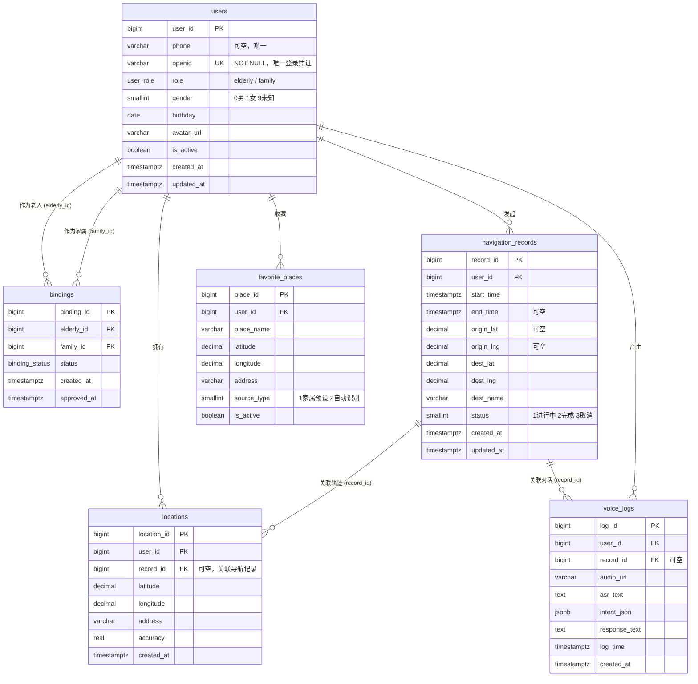

# 数据库表结构设计文档 (PostgreSQL)

## 目录

- [数据库表结构设计文档 (PostgreSQL)](#数据库表结构设计文档-postgresql)
  - [目录](#目录)
  - [1. 用户表 (users)](#1-用户表-users)
    - [字段结构](#字段结构)
    - [索引设计](#索引设计)
    - [关联关系](#关联关系)
  - [2. 绑定表 (bindings)](#2-绑定表-bindings)
    - [字段结构](#字段结构-1)
    - [枚举值](#枚举值)
    - [索引设计](#索引设计-1)
    - [关联关系](#关联关系-1)
  - [3. 位置表 (locations)](#3-位置表-locations)
    - [字段结构](#字段结构-2)
    - [索引设计](#索引设计-2)
    - [关联关系](#关联关系-2)
  - [4. 收藏地点表 (favorite_places)](#4-收藏地点表-favorite_places)
    - [字段结构](#字段结构-3)
    - [索引设计](#索引设计-3)
    - [关联关系](#关联关系-3)
  - [5. 导航记录表 (navigation_records)](#5-导航记录表-navigation_records)
    - [字段结构](#字段结构-4)
    - [索引设计](#索引设计-4)
    - [关联关系](#关联关系-4)
  - [6. 语音日志表 (voice_logs)](#6-语音日志表-voice_logs)
    - [字段结构](#字段结构-5)
    - [索引设计](#索引设计-5)
    - [关联关系](#关联关系-5)
  - [表间关联关系图（ER 图）](#表间关联关系图er-图)
    - [关系类型说明](#关系类型说明)
  - [数据汇总](#数据汇总)
  - [备注](#备注)

---

## 1. 用户表 (users)

用户表是系统的核心表，存储所有用户（老人和家属）的基本信息。  
**登录凭据**：系统以 `openid` 作为唯一登录凭证，`phone` 为辅助信息（可空）。

### 字段结构

| 字段名                 | 数据类型     | 约束条件                                 | 默认值 | 说明                              |
| ---------------------- | ------------ | ---------------------------------------- | ------ | --------------------------------- |
| user_id                | BIGINT       | PRIMARY KEY GENERATED ALWAYS AS IDENTITY | -      | 用户ID，自增主键                  |
| phone                  | VARCHAR(20)  | NULL, UNIQUE                             | -      | 手机号（非必须，可空）            |
| nickname               | VARCHAR(50)  | NULL                                     | -      | 昵称                              |
| openid                 | VARCHAR(255) | NOT NULL, UNIQUE                         | -      | **微信OpenID（唯一登录凭证）**    |
| **session_key 已移除** | -            | -                                        | -      | **敏感信息，存放在Redis等缓存中** |
| role                   | user_role    | NOT NULL                                 | -      | 角色：elderly / family            |
| gender                 | SMALLINT     | NULL, CHECK(gender IN (0,1,9))           | 9      | 性别：0-男, 1-女, 9-未知性别      |
| birthday               | DATE         | NULL                                     | -      | 生日                              |
| avatar_url             | VARCHAR(255) | NULL                                     | -      | 头像URL                           |
| is_active              | BOOLEAN      | NOT NULL                                 | TRUE   | 是否激活                          |
| created_at             | TIMESTAMPTZ  | NOT NULL                                 | now()  | 创建时间（带时区）                |
| updated_at             | TIMESTAMPTZ  | NOT NULL                                 | now()  | 更新时间（带时区）                |

> **说明**：`openid` 为唯一登录凭证，必须非空且唯一。`phone` 可空，若用户绑定了手机号则必须唯一。

### 索引设计

| 索引类型     | 索引名称         | 索引字段 | 补充说明                         |
| ------------ | ---------------- | -------- | -------------------------------- |
| PRIMARY KEY  | users_pkey       | user_id  | 默认 btree，唯一                 |
| UNIQUE INDEX | users_openid_key | openid   | **核心唯一凭证**                 |
| UNIQUE INDEX | users_phone_key  | phone    | 允许空值，保证已填写的手机号唯一 |

### 关联关系

| 关联表             | 关系类型       | 说明               |
| ------------------ | -------------- | ------------------ |
| locations          | 一对多         | 用户的位置记录     |
| bindings           | 一对多（老人） | 作为老人的绑定关系 |
| bindings           | 一对多（家属） | 作为家属的绑定关系 |
| favorite_places    | 一对多         | 收藏地点           |
| navigation_records | 一对多         | 导航记录           |
| voice_logs         | 一对多         | 语音日志           |

---

## 2. 绑定表 (bindings)

绑定表存储老人与家属之间的关联关系，支持多种绑定状态。

### 字段结构

| 字段名      | 数据类型       | 约束条件                                              | 默认值    | 说明                                |
| ----------- | -------------- | ----------------------------------------------------- | --------- | ----------------------------------- |
| binding_id  | BIGINT         | PRIMARY KEY GENERATED ALWAYS AS IDENTITY              | -         | 绑定ID，自增主键                    |
| elderly_id  | BIGINT         | NOT NULL, REFERENCES users(user_id) ON DELETE CASCADE | -         | 老人ID                              |
| family_id   | BIGINT         | NOT NULL, REFERENCES users(user_id) ON DELETE CASCADE | -         | 家属ID                              |
| status      | binding_status | NOT NULL                                              | 'pending' | 状态：pending / accepted / rejected |
| created_at  | TIMESTAMPTZ    | NOT NULL                                              | now()     | 创建时间                            |
| approved_at | TIMESTAMPTZ    | NULL                                                  | -         | 审批时间                            |

### 枚举值

```sql
CREATE TYPE binding_status AS ENUM ('pending', 'accepted', 'rejected');
```

### 索引设计

| 索引类型      | 索引名称                   | 索引字段                | 用途说明                                   |
| ------------- | -------------------------- | ----------------------- | ------------------------------------------ |
| PRIMARY KEY   | bindings_pkey              | binding_id              |                                            |
| INDEX (BTREE) | idx_bindings_elderly       | elderly_id              | 加速查询老人的绑定列表                     |
| INDEX (BTREE) | idx_bindings_family        | family_id               | 加速查询家属的绑定列表                     |
| UNIQUE INDEX  | uq_bindings_elderly_family | (elderly_id, family_id) | **防止重复绑定**（同一对用户不可重复绑定） |

### 关联关系

| 关联表 | 关系类型       | 外键字段   |
| ------ | -------------- | ---------- |
| users  | 外键（多对一） | elderly_id |
| users  | 外键（多对一） | family_id  |

---

## 3. 位置表 (locations)

记录用户的实时位置信息。

### 字段结构

| 字段名      | 数据类型      | 约束条件                                                     | 默认值 | 说明                     |
| ----------- | ------------- | ------------------------------------------------------------ | ------ | ------------------------ |
| location_id | BIGINT        | PRIMARY KEY GENERATED ALWAYS AS IDENTITY                     | -      | 位置ID，自增主键         |
| user_id     | BIGINT        | NOT NULL, REFERENCES users(user_id) ON DELETE CASCADE        | -      | 用户ID                   |
| record_id   | BIGINT        | NULL, REFERENCES navigation_records(record_id) ON DELETE SET NULL | -      | 关联的导航记录ID，可为空 |
| latitude    | DECIMAL(10,8) | NOT NULL                                                     | -      | 纬度                     |
| longitude   | DECIMAL(11,8) | NOT NULL                                                     | -      | 经度                     |
| address     | VARCHAR(255)  | NULL                                                         | -      | 地址                     |
| accuracy    | REAL          | NULL                                                         | -      | 精度（米）               |
| created_at  | TIMESTAMPTZ   | NOT NULL                                                     | now()  | 创建时间                 |

> **一致性约束**：当 `record_id` 不为空时，应用层需保证该 `user_id` 与对应导航记录中的 `user_id` 一致。

### 索引设计

| 索引类型      | 索引名称                | 索引字段                   | 用途说明                 |
| ------------- | ----------------------- | -------------------------- | ------------------------ |
| PRIMARY KEY   | locations_pkey          | location_id                |                          |
| INDEX (BTREE) | idx_locations_user_time | (user_id, created_at DESC) | 高效查询某用户的最新位置 |
| INDEX (BTREE) | idx_locations_record    | record_id                  | 按导航记录查询轨迹       |

### 关联关系

| 关联表             | 关系类型       | 外键字段  |
| ------------------ | -------------- | --------- |
| users              | 外键（多对一） | user_id   |
| navigation_records | 外键（多对一） | record_id |

---

## 4. 收藏地点表 (favorite_places)

存储老人的常用地点。

### 字段结构

| 字段名      | 数据类型      | 约束条件                                              | 默认值 | 说明                         |
| ----------- | ------------- | ----------------------------------------------------- | ------ | ---------------------------- |
| place_id    | BIGINT        | PRIMARY KEY GENERATED ALWAYS AS IDENTITY              | -      | 地点ID                       |
| user_id     | BIGINT        | NOT NULL, REFERENCES users(user_id) ON DELETE CASCADE | -      | 所属老人ID                   |
| place_name  | VARCHAR(100)  | NOT NULL                                              | -      | 地点名称（如：儿子家）       |
| latitude    | DECIMAL(10,8) | NOT NULL                                              | -      | 纬度                         |
| longitude   | DECIMAL(11,8) | NOT NULL                                              | -      | 经度                         |
| address     | VARCHAR(500)  | NOT NULL                                              | -      | 详细地址                     |
| source_type | SMALLINT      | NOT NULL, CHECK(source_type IN (1,2))                 | 1      | 来源：1-家属预设, 2-自动识别 |
| is_active   | BOOLEAN       | NOT NULL                                              | TRUE   | 是否激活                     |

### 索引设计

| 索引类型      | 索引名称             | 索引字段               | 用途说明                     |
| ------------- | -------------------- | ---------------------- | ---------------------------- |
| PRIMARY KEY   | favorite_places_pkey | place_id               |                              |
| INDEX (BTREE) | idx_fav_user_source  | (user_id, source_type) | 按用户和来源查询收藏地点     |
| UNIQUE INDEX  | uq_fav_user_place    | (user_id, place_name)  | **防止同一用户添加同名地点** |

### 关联关系

| 关联表 | 关系类型       | 外键字段 |
| ------ | -------------- | -------- |
| users  | 外键（多对一） | user_id  |

---

## 5. 导航记录表 (navigation_records)

存储用户的导航历史。

### 字段结构

| 字段名     | 数据类型      | 约束条件                                              | 默认值 | 说明                           |
| ---------- | ------------- | ----------------------------------------------------- | ------ | ------------------------------ |
| record_id  | BIGINT        | PRIMARY KEY GENERATED ALWAYS AS IDENTITY              | -      | 记录ID                         |
| user_id    | BIGINT        | NOT NULL, REFERENCES users(user_id) ON DELETE CASCADE | -      | 用户ID                         |
| start_time | TIMESTAMPTZ   | NOT NULL                                              | -      | 导航开始时间                   |
| end_time   | TIMESTAMPTZ   | NULL                                                  | -      | 结束时间（进行中为空）         |
| origin_lat | DECIMAL(10,8) | NULL                                                  | -      | 起点纬度                       |
| origin_lng | DECIMAL(11,8) | NULL                                                  | -      | 起点经度                       |
| dest_lat   | DECIMAL(10,8) | NOT NULL                                              | -      | 终点纬度                       |
| dest_lng   | DECIMAL(11,8) | NOT NULL                                              | -      | 终点经度                       |
| dest_name  | VARCHAR(100)  | NULL                                                  | -      | 目的地名称                     |
| status     | SMALLINT      | NOT NULL, CHECK(status IN (1,2,3))                    | 1      | 状态：1-进行中, 2-完成, 3-取消 |
| created_at | TIMESTAMPTZ   | NOT NULL                                              | now()  | 创建时间                       |
| updated_at | TIMESTAMPTZ   | NOT NULL                                              | now()  | 更新时间                       |

> **业务约束**：应用层需保证当 `status=2` 时 `end_time` 不为空。

### 索引设计

| 索引类型      | 索引名称           | 索引字段              | 用途说明                     |
| ------------- | ------------------ | --------------------- | ---------------------------- |
| PRIMARY KEY   | nav_records_pkey   | record_id             |                              |
| INDEX (BTREE) | idx_nav_user_start | (user_id, start_time) | 查询用户历史导航，按时间排序 |
| INDEX (BTREE) | idx_nav_status     | (status)              | 筛选进行中的导航             |

### 关联关系

| 关联表     | 关系类型       | 外键字段 | 说明                         |
| ---------- | -------------- | -------- | ---------------------------- |
| users      | 外键（多对一） | user_id  |                              |
| locations  | 一对多         |          | 一条导航记录可有多个位置点   |
| voice_logs | 一对多         |          | 一条导航记录可有多条语音日志 |

---

## 6. 语音日志表 (voice_logs)

存储语音交互的完整记录。

### 字段结构

| 字段名        | 数据类型     | 约束条件                                                     | 默认值 | 说明                              |
| ------------- | ------------ | ------------------------------------------------------------ | ------ | --------------------------------- |
| log_id        | BIGINT       | PRIMARY KEY GENERATED ALWAYS AS IDENTITY                     | -      | 日志ID                            |
| user_id       | BIGINT       | NOT NULL, REFERENCES users(user_id) ON DELETE CASCADE        | -      | 用户ID                            |
| record_id     | BIGINT       | NULL, REFERENCES navigation_records(record_id) ON DELETE SET NULL | -      | 关联导航记录ID（可为空）          |
| audio_url     | VARCHAR(255) | NULL                                                         | -      | 语音文件路径（建议对象存储）      |
| asr_text      | TEXT         | NULL                                                         | -      | 语音识别文本                      |
| intent_json   | JSONB        | NULL                                                         | -      | AI 意图结构化数据（JSONB 更高效） |
| response_text | TEXT         | NULL                                                         | -      | 系统回复文本                      |
| log_time      | TIMESTAMPTZ  | NOT NULL                                                     | now()  | 日志时间                          |
| created_at    | TIMESTAMPTZ  | NOT NULL                                                     | now()  | 创建时间                          |

### 索引设计

| 索引类型      | 索引名称            | 索引字段                 | 用途说明                             |
| ------------- | ------------------- | ------------------------ | ------------------------------------ |
| PRIMARY KEY   | voice_logs_pkey     | log_id                   |                                      |
| INDEX (BTREE) | idx_voice_user_time | (user_id, log_time DESC) | 查询某用户的语音历史，按时间倒序     |
| INDEX (BTREE) | idx_voice_record    | record_id                | 按导航记录查询关联语音               |
| INDEX (GIN)   | idx_voice_intent    | intent_json              | **JSONB 索引**，支持意图字段复杂查询 |

### 关联关系

| 关联表             | 关系类型       | 外键字段  | 说明                         |
| ------------------ | -------------- | --------- | ---------------------------- |
| users              | 外键（多对一） | user_id   |                              |
| navigation_records | 外键（多对一） | record_id | 为空表示非导航期间的语音交互 |

---

## 表间关联关系图（ER 图）



### 关系类型说明

| 关系类型      | 说明                         | 示例                            |
| ------------- | ---------------------------- | ------------------------------- |
| 一对多（1:N） | 一个用户对应多个位置         | users → locations               |
| 一对多（1:N） | 一个用户对应多个收藏地点     | users → favorite_places         |
| 一对多（1:N） | 一个用户对应多个导航记录     | users → navigation_records      |
| 一对多（1:N） | 一个用户对应多条语音日志     | users → voice_logs              |
| 自引用        | 同一表内通过绑定表关联       | bindings：老人与家属            |
| 一对多（1:N） | 一个导航记录对应多个位置     | navigation_records → locations  |
| 一对多（1:N） | 一个导航记录对应多条语音日志 | navigation_records → voice_logs |

---

## 数据汇总

| 表名               | 主键策略        | 外键数量 | 主要索引                                          | 记录类型 |
| ------------------ | --------------- | -------- | ------------------------------------------------- | -------- |
| users              | IDENTITY BIGINT | 0        | openid 唯一，phone 唯一（允许空）                 | 用户信息 |
| bindings           | IDENTITY BIGINT | 2        | 老人ID、家属ID、老人-家属唯一组合                 | 绑定关系 |
| locations          | IDENTITY BIGINT | 2        | (user_id, created_at)、record_id                  | 位置记录 |
| favorite_places    | IDENTITY BIGINT | 1        | (user_id, source_type)、user_id+place_name 唯一   | 收藏地点 |
| navigation_records | IDENTITY BIGINT | 1        | (user_id, start_time)、status                     | 导航记录 |
| voice_logs         | IDENTITY BIGINT | 2        | (user_id, log_time)、record_id、intent_json (GIN) | 语音日志 |

---

## 备注

1. **登录凭证**：`openid` 是唯一不可为空的登录凭证，`phone` 为选填信息。
2. **级联操作**：大部分子表设置了 `ON DELETE CASCADE`；`locations` 和 `voice_logs` 的 `record_id` 使用 `ON DELETE SET NULL`，避免删除导航记录时丢失位置/语音数据。
3. **地理精度**：经纬度使用 `DECIMAL(10,8)` 与 `DECIMAL(11,8)`，建议后续引入 PostGIS 以支持空间计算。
4. **唯一约束**：在 `bindings` 和 `favorite_places` 上添加了业务唯一约束，防止数据重复。
5. **安全合规**：
   - `session_key` 不落入持久化存储，统一使用 Redis 管理。
   - 音频文件建议存储至对象存储，URL 设置时效性。
6. **数据生命周期**：`voice_logs` 和 `locations` 可能快速增长，建议按时间分区或定期归档（如保留180天热数据），并监控磁盘使用。
7. **扩展性**：`voice_logs.intent_json` 使用 JSONB 类型，便于未来扩展意图结构而无需 DDL 变更。

